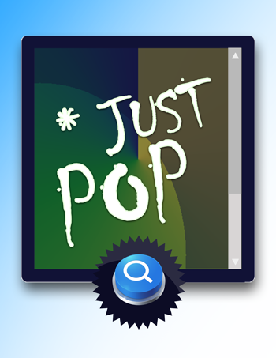

# JustP0P - Informative Simple Modal



### ng-JustPOP is built in Angular 5+, The Module is a Simple Popup with configuration options to output a simple binding. JustPOP comes with a built-in Magic Scroller, which allows you to dynamically create content, It's magic. 


## Installation:

* Please Download the package from here, and place it inside your project, In the case you don't have a project yet, Please go ahead and create a new one `ng new myApp`. ([Angular CLI Documentation](https://angular.io/cli))
* Import the Module inside your app.module.ts `import { JustPopupModule } from './ng-JustPop';`
* Add it to your Import Brackets `JustPopupModule.forRoot()` on app.module.ts

```
import { BrowserModule } from '@angular/platform-browser';
import { NgModule } from '@angular/core';
import { HomePageComponent } from './home-page/home-page.component';

import { AppComponent } from './app.component';
// Import JustPopup Module
import { JustPopupModule } from './ng-JustPop';

@NgModule({
  declarations: [
    AppComponent,
    HomePageComponent
  ],
  imports: [
    BrowserModule,
    // Import into the APP
    JustPopupModule.forRoot()
  ],
  providers: [],
  bootstrap: [AppComponent]
})
export class AppModule { }
```

## Modal Schema:

```
 theme: {
                header_container: {
                  title: 'INFORMATIVE POPUP',
                  left_image: './assets/images/category.png',
                  left_width: '24px',
                  background: '#fffcc'
                },
                body_container: {
                  title: '',
                  content: this.ipsum + this.ipsum,
                  background: '#fff'
                },
                footer_container: {
                  title: 'Footer Container',
                  background: '#fff'
                }
              },
              buttons: {
                left: {
                    label: 'MORE INFO',
                    color: 'btn-flat',
                    enabled: false,
                    routing: true,
                    path: 'https://google.com',
                    target: 'blank'
                },
                right: {
                    label: 'CLOSE',
                    color: 'btn-flat',
                    enabled: true,
                    routing: false
                }
            },
              selector: {
                id: 'JustPOP'
              },
              init_button: {
                selector: 'JustPOP,
                label: 'INFORMATION',
                color: 'btn-primary',
              }

```

## Get Started:

1) Create a new component within your application, Let's start by openning the terminal on location of our project, Create a new component using angular-cli `ng g c homePage` this is the short-hand g = generate, c = component. Read more at the [Angular CLI Documentation](https://angular.io/cli).

2) Open the newly created component `.ts` file by angular-cli, `app/home-page/home-page.component.ts`

3) Create a property, for this example, We will be using `modalData` go ahead and create it before the `constructor(){}` - `private modalData: any = {};`

4) Fire it, depending on your needs, on the `constructor(){}` or `ngOnInit(){}`

```
    ngOnInit(): void {
        this.modalData = {
            // Copy Above Modal Schema Data 
        }
    }
```

5) Include the Wrapper and Button Selector on the HTML file created by the angular-cli `app/home-page/home-page.component.html`.

```
<!-- Place Button to Trigger -->
<just-pop 
    [config]="modalData.theme.init_button">
</just-pop>
    
<!-- Wrapper Container -->
<just-pop-wrapper 
    [config]="modalData" 
    (closed)="closeModal($event)">
</just-pop-wrapper>
```
#### Selectors Breakdown

*  `just-pop`: This selector contains the button selector and the option for the popup to be trigger, it could be placed anywhere in the page, it must contain a configuration that comes from the `modalData` started before on the `ngOnInit(){}`.

* `just-pop-wrapper`: This selector contains the main body of the popup, In order to open the correct modal, please make sure to have a similar id has the `just-pop`. It also has to be on the same page of the `just-pop`, it could be place anywhere it just has to be on the same html file. This wrapper also contain two output events in order to communicate back and forth with the inner components.

6) Save our HTML File, and Let's go back to our `.TS` file, `app/home-page/home-page.component.ts` 
If you realized in the HTML Markup, there is two functions that get trigger whenever save or close button gets click Let's go ahead and create them to pass the `$event` of the click.

```
closeModal(e){
    console.log(e)
}
```